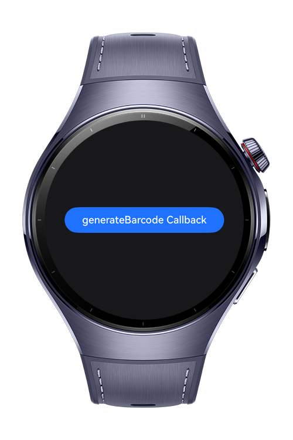
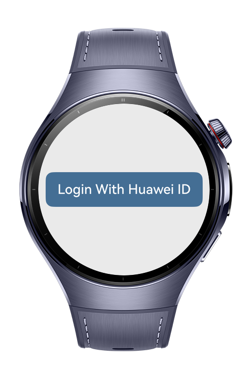
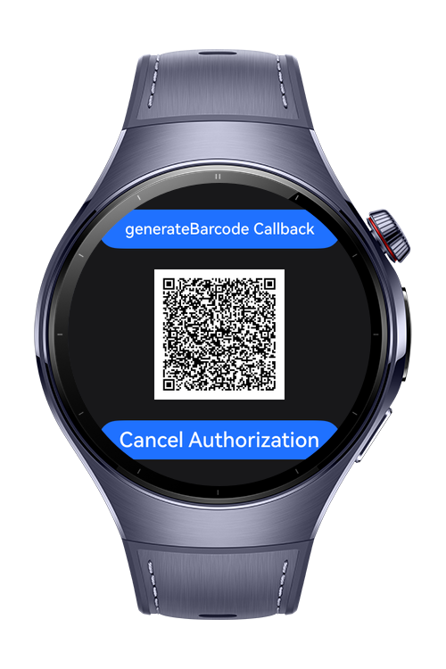

> **Note:** To access all shared projects, get information about environment setup, and view other guides, please visit [Explore-In-HMOS-Wearable Index](https://github.com/Explore-In-HMOS-Wearable/hmos-index).

# DemoAuthScan

In this application, we can log in to the application using the scan kit, account kit and scenario fusion kit and get the device information with the QR code.

# Preview

<div>    
  
  
  
</div> 

# Use Cases

useful and simple application that allows the user to retrieve account and device information via qr code.

# Tech Stack

- **Languages**: ArkTS
- **Frameworks**: HarmonyOS SDK 5.1.0(18)
- **Tools**: DevEco Studio Vers 5.1.0.842
- **Libraries**: @kit.ArkUI, @kit.Accountkit,@kit.ScenarioFusionKit,@kit.Scan

# Directory Structure

````
│   module.json5
│
├───ets
│   ├───entryability
│   │       EntryAbility.ets
│   │
│   ├───entrybackupability
│   │       EntryBackupAbility.ets
│   │
│   ├───helper
│   │       Accountkit.ets
│   │       ScenarioFusionKit.ets
│   │
│   ├───pages
│   │       Index.ets
│   │       Scan.ets
│   │
│   └───viewmodel
│           AccountViewModel.ets
│           AccountViewModelSingleton.ets
│           ScenarioFusionKitModel.ets
│
└───resources
    ├───base
    │   ├───element
    │   │       color.json
    │   │       float.json
    │   │       string.json
    │   │
    │   ├───media
    │   │       background.png
    │   │       foreground.png
    │   │       layered_image.json
    │   │       startIcon.png
    │   │
    │   └───profile
    │           backup_config.json
    │           main_pages.json
    │
    ├───dark
    │   └───element
    │           color.json
    │
    └───rawfile

````

# Constraints and Restrictions

## Suported Devices

- Huawei Watch 5

# License

DemoAuthScan is distributed under the terms of the MIT License.
See the [LICENSE](./LICENSE) for more information.